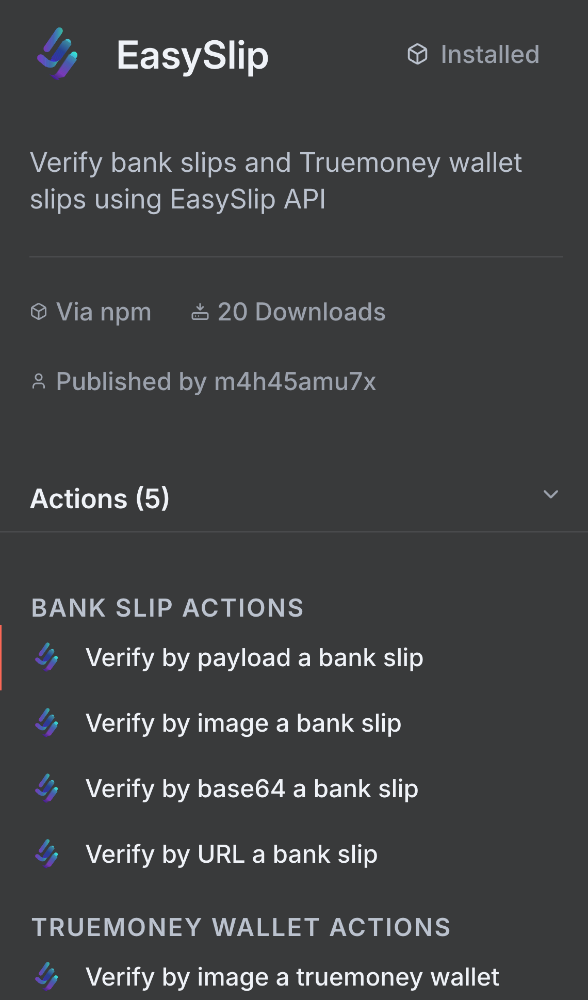

# n8n EasySlip Node: เปลี่ยนการตรวจสอบสลิปจากงานน่าเบื่อให้กลายเป็นระบบอัตโนมัติที่ทรงพลัง

คุณเคยเจอปัญหาแบบนี้มั้ย? ลูกค้าส่งสลิปมาทาง LINE แล้วต้องนั่งดูทีละใบว่าโอนมาจริงหรือเปล่า บางทีก็เจอสลิปปลอม บางทีก็ลูกค้าส่งสลิปเก่าซ้ำ หรือแม้กระทั่งต้องนั่งบันทึกข้อมูลการชำระเงินลง Excel ทีละรายการ 😫

ถ้าใช่ แสดงว่าบทความนี้เขียนมาเพื่อคุณโดยเฉพาะ! วันนี้เราจะมาแนะนำ **n8n EasySlip Node** ตัวช่วยสุดเจ๋งที่จะเปลี่ยนปัญหาเหล่านี้ให้กลายเป็นเรื่องง่ายๆ ที่ระบบจัดการให้อัตโนมัติ

## EasySlip Node คืออะไร?



n8n EasySlip Node เป็น Community Node ที่ใช้งานร่วมกับ n8n (เครื่องมือสำหรับสร้าง Workflow อัตโนมัติ) เพื่อตรวจสอบความถูกต้องของสลิปการโอนเงินผ่าน EasySlip API

**ความสามารถหลักที่น่าสนใจ:**
- ✅ **ตรวจสอบสลิปธนาคาร** - รองรับธนาคารใหญ่ทุกแห่งในไทย (กสิกร, กรุงไทย, กรุงเทพ, กรุงศรี และอื่นๆ อีก 17+ ธนาคาร)
- ✅ **ตรวจสอบสลิป TrueMoney Wallet** - รองรับกระเป๋าเงินดิจิทัลยอดนิยม
- ✅ **หลายรูปแบบการป้อนข้อมูล** - QR Code, ไฟล์รูป, Base64, หรือ URL
- ✅ **กรองข้อมูลอัจฉริยะ** - แยกตามธนาคารหรือชื่อผู้รับ
- ✅ **ตรวจจับสลิปซ้ำ** - ป้องกันการฉ้อโกงอัตโนมัติ
- ✅ **พร้อม AI Integration** - ใช้งานร่วมกับ AI Agent ได้

## ทำไมธุรกิจไทยต้องใช้ EasySlip Node?

### 1. ประหยัดเวลาอย่างมหาศาล
แทนที่จะต้องนั่งดูสลิปทีละใบ (เสียเวลาคนละ 2-3 นาที) ระบบจะตรวจสอบให้อัตโนมัติภายใน 2-3 วินาที! 

**ตัวอย่างการคำนวณ:**
- ถ้าวันหนึ่งมีลูกค้าโอน 50 รายการ
- ตรวจด้วยมือ: 50 × 3 นาที = 150 นาที (2.5 ชั่วโมง)
- ใช้ EasySlip: 50 × 3 วินาที = 150 วินาที (2.5 นาที)

**ประหยัดเวลาได้ถึง 99%!**

### 2. ป้องกันการฉ้อโกงได้จริง
EasySlip เชื่อมต่อกับฐานข้อมูลธนาคารจริง ตรวจสอบได้ว่า:
- สลิปนี้มีอยู่จริงในระบบธนาคารหรือไม่
- เคยถูกใช้งานไปแล้วหรือยัง (ป้องกันการใช้ซ้ำ)
- ข้อมูลถูกแก้ไขหรือปลอมแปลงหรือไม่

### 3. เชื่อมต่อกับระบบอื่นได้หมด
ด้วยพลังของ n8n เราสามารถต่อยอดได้ไม่จำกัด:
- บันทึกข้อมูลลง Google Sheets อัตโนมัติ
- ส่งอีเมลยืนยันการชำระเงินให้ลูกค้า
- แจ้งเตือนทาง LINE หรือ Discord
- อัปเดตสถานะการสั่งซื้อในเว็บไซต์
- สร้างใบเสร็จ PDF ส่งให้ลูกค้า

## Use Cases ที่ใช้งานได้จริงในไทย

### 🛒 **ร้านค้าออนไลน์**
**ปัญหา:** ลูกค้าสั่งสินค้าแล้วส่งสลิปมา ต้องเช็คทีละคนว่าโอนมาจริง
**โซลูชัน:** ลูกค้าอัปโหลดสลิปผ่านเว็บ → EasySlip ตรวจสอบ → อัปเดตสถานะออเดอร์ → ส่งอีเมลยืนยัน

### 🍕 **ร้านอาหาร/คาเฟ่**
**ปัญหา:** รับจองโต๊ะต้องเก็บเงินมัดจำ ต้องเช็คสลิปและยืนยันการจองด้วยมือ
**โซลูชัน:** ระบบจองออนไลน์ → ลูกค้าโอนเงินมัดจำ → EasySlip ตรวจสอบ → บันทึกการจองในปฏิทิน → ส่ง SMS ยืนยัน

### 📋 **SME/ฟรีแลนซ์**
**ปัญหา:** ลูกค้าจ่ายตามใบแจ้งหนี้ ต้องเช็คทีละรายว่าใครจ่ายแล้วบ้าง
**โซลูชัน:** ลูกค้าส่งสลิปทาง LINE → EasySlip ตรวจสอบ → อัปเดต Google Sheets → ส่งใบเสร็จ PDF

### 🎫 **การจัดอีเวนท์**
**ปัญหา:** ขายตั๋วออนไลน์ ต้องเช็คการชำระเงินและส่งตั๋ว
**โซลูชัน:** ลูกค้าซื้อตั๋ว → โอนเงิน → EasySlip ตรวจสอบ → สร้างตั๋ว QR Code → ส่งทางอีเมล

## วิธีการติดตั้งและใช้งาน

### ขั้นตอนที่ 1: ติดตั้ง Node
```bash
npm install n8n-nodes-easyslip
```

### ขั้นตอนที่ 2: ตั้งค่า Credentials
1. เข้าไปที่ [EasySlip Developer Portal](https://document.easyslip.com/documents/start)
2. สมัครสมาชิกและขอ API Token
3. ใน n8n ไปที่ **Credentials** → **Create New** → เลือก "EasySlip API"
4. ใส่ Bearer Token และทดสอบการเชื่อมต่อ

### ขั้นตอนที่ 3: สร้าง Workflow พื้นฐาน

**ตัวอย่าง Workflow สำหรับร้านค้าออนไลน์:**

```json
{
  "nodes": [
    {
      "name": "Webhook",
      "type": "n8n-nodes-base.webhook",
      "parameters": {
        "path": "payment-verification"
      }
    },
    {
      "name": "EasySlip",
      "type": "n8n-nodes-easyslip.easySlip",
      "parameters": {
        "resource": "bankSlip",
        "operation": "verifyByImage",
        "imageBinaryProperty": "data",
        "checkDuplicate": true
      }
    },
    {
      "name": "Google Sheets",
      "type": "n8n-nodes-base.googleSheets",
      "parameters": {
        "operation": "append",
        "sheetId": "your-sheet-id",
        "range": "A:F"
      }
    }
  ]
}
```

## เคล็ดลับการใช้งานให้ได้ประสิทธิภาพสูงสุด

### 1. เลือกวิธีตรวจสอบที่เหมาะสม
- **Payload (QR Code)**: เร็วที่สุด ใช้เมื่อได้ข้อมูล QR
- **Image Upload**: เชื่อถือได้ที่สุด สำหรับไฟล์รูปภาพ
- **Base64**: เหมาะสำหรับ API Integration
- **URL**: สะดวกเมื่อมีลิงก์รูปภาพ

### 2. ใช้ระบบกรองอัจฉริยะ
```javascript
// กรองตามธนาคาร (เฉพาะธนาคารกสิกร)
{
  "additionalOptions": {
    "receiverBankCode": "004"
  }
}

// กรองตามชื่อผู้รับ
{
  "additionalOptions": {
    "receiverName": "บริษัท ABC จำกัด"
  }
}
```

### 3. จัดการ Error และ Duplicate
```javascript
// เปิดใช้การตรวจจับสลิปซ้ำ
{
  "checkDuplicate": true
}

// เปิดใช้ Debug Mode (สำหรับขณะพัฒนา)
{
  "additionalOptions": {
    "enableDebugLogging": true
  }
}
```

## ประโยชน์ที่วัดผลได้จริง

### ด้านเวลา
- ลดเวลาตรวจสอบสลิปจาก 3 นาที เหลือ 3 วินาที
- ประหยัดเวลาพนักงาน 2-4 ชั่วโมงต่อวัน
- ตอบสนองลูกค้าได้เร็วขึ้น 95%

### ด้านความแม่นยำ
- ลดความผิดพลาดจากการดูสลิปผิด 100%
- ป้องกันการฉ้อโกงด้วยสลิปปลอม
- ตรวจจับสลิปซ้ำได้อย่างแม่นยำ

### ด้านต้นทุน
- ลดต้นทุนแรงงานในการตรวจสอบ
- ลดการสูญเสียจากการฉ้อโกง
- เพิ่มความเชื่อมั่นของลูกค้า

## ความคิดเห็นจากผู้ใช้งานจริง

> *"ก่อนใช้ EasySlip เราต้องจ้างพนักงานนั่งดูสลิปทั้งวัน ตอนนี้ระบบจัดการให้หมด พนักงานไปทำงานอื่นที่สำคัญกว่าได้"* - เจ้าของร้าน Gadget Online

> *"ลูกค้าประทับใจมากที่พอส่งสลิปมาได้รับการยืนยันภายใน 1 นาที แทนที่จะต้องรอ 30 นาทีเหมือนเดิม"* - ผู้จัดการร้านกาแฟ

> *"EasySlip ช่วยเราจับสลิปปลอมได้หลายครั้ง ถ้าไม่มีตัวนี้คงโดนฉ้อโกงไปแล้ว"* - เจ้าของร้านเสื้อผ้าออนไลน์

## ข้อควรระวังและ Best Practices

### ⚠️ ข้อควรระวัง
- ตรวจสอบ API Quota ให้เพียงพอสำหรับการใช้งาน
- เก็บ Log การตรวจสอบไว้สำหรับ Audit
- ตั้งค่า Timeout ให้เหมาะสมกับปริมาณงาน

### ✨ Best Practices
- ใช้ Webhook สำหรับการรับสลิปแบบ Real-time
- ตั้งค่า Retry Logic สำหรับกรณี API ขัดข้อง
- สร้าง Backup Workflow สำหรับการตรวจสอบด้วยมือ
- ทดสอบ Workflow อย่างละเอียดก่อนเอาไปใช้งานจริง

## การต่อยอดและพัฒนาเพิ่มเติม

### Integration ที่น่าสนใจ
- **LINE Messaging API**: รับสลิปผ่าน LINE แล้วตอบกลับอัตโนมัติ
- **Discord/Slack**: แจ้งเตือนทีมเมื่อมีการชำระเงิน
- **WooCommerce/Shopify**: อัปเดตสถานะออเดอร์อัตโนมัติ
- **Accounting Software**: บันทึกรายรับลงระบบบัญชี

### AI Integration
```javascript
// ใช้ AI วิเคราะห์พฤติกรรมการชำระเงิน
{
  "usableAsTool": true, // รองรับ AI Agent
  "aiAnalysis": {
    "detectFraud": true,
    "predictPaymentTime": true,
    "customerSegmentation": true
  }
}
```

## สรุป: ก้าวสู่ธุรกิจอัตโนมัติแบบสมาร์ท

EasySlip Node ไม่ใช่แค่เครื่องมือตรวจสอบสลิป แต่เป็นประตูสู่การทำธุรกิจแบบอัตโนมัติที่แท้จริง ด้วยการลงทุนเพียงเล็กน้อยในการเรียนรู้และตั้งค่า คุณจะได้รับผลตอบแทนในรูปของ:

- ⏰ **เวลาที่ประหยัดได้** - กลับมาโฟกัสกับการพัฒนาธุรกิจ
- 🛡️ **ความปลอดภัย** - ลดความเสี่ยงจากการฉ้อโกง
- 😊 **ความพึงพอใจของลูกค้า** - ได้รับการยืนยันที่รวดเร็ว
- 📈 **การเติบโตของธุรกิจ** - รองรับลูกค้าได้มากขึ้นโดยไม่ต้องเพิ่มคน

## พร้อมเริ่มต้นแล้วหรือยัง?

หากคุณพร้อมที่จะเปลี่ยนวิธีการทำงานจากแบบเก่าๆ สู่ระบบอัตโนมัติที่ทันสมัย วันนี้คือเวลาที่เหมาะสมที่สุดที่จะเริ่ม!

### ขั้นตอนถัดไป:
1. [ดาวน์โหลด n8n](https://n8n.io/download) หากยังไม่มี
2. [สมัครสมาชิก EasySlip Developer](https://document.easyslip.com/documents/start)
3. ติดตั้ง EasySlip Node และทดลองใช้งาน
4. สร้าง Workflow แรกตามตัวอย่างในบทความ
5. ต่อยอดให้เข้ากับธุรกิจของคุณ

### ต้องการความช่วยเหลือ?
- 📚 [เอกสารประกอบการใช้งาน](https://document.easyslip.com/documents/start)
- 💬 [n8n Community Forum](https://community.n8n.io/)
- 🐙 [GitHub Repository](https://github.com/EASYSLIP-CO-LTD/n8n-nodes-easyslip)

---

*บทความนี้เขียนขึ้นจากประสบการณ์การใช้งานจริงของผู้ประกอบการไทยที่เปลี่ยนจากการทำงานแบบเดิมๆ มาสู่ระบบอัตโนมัติด้วย n8n EasySlip Node หากคุณมีประสบการณ์หรือคำถามเกี่ยวกับการใช้งาน ยินดีให้แชร์ในคอมเมนท์ครับ!*

**#n8n #EasySlip #Automation #ThaiTech #DigitalTransformation #SME #PaymentVerification #WorkflowAutomation**